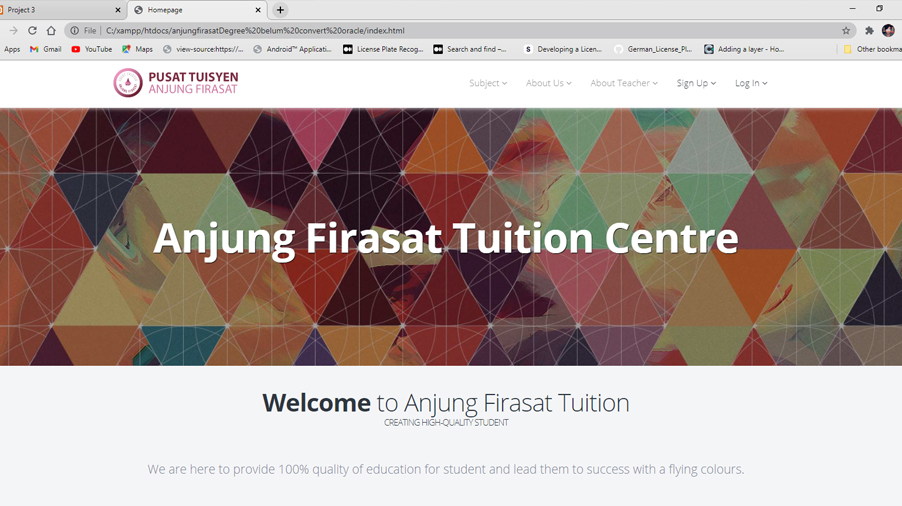
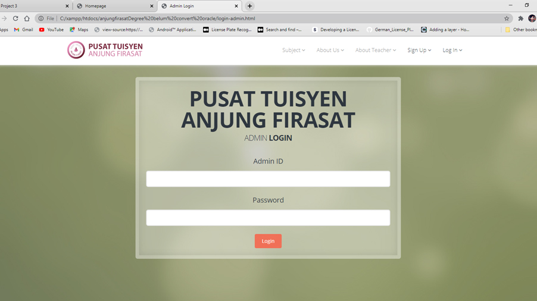
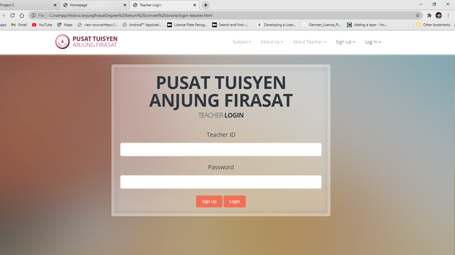
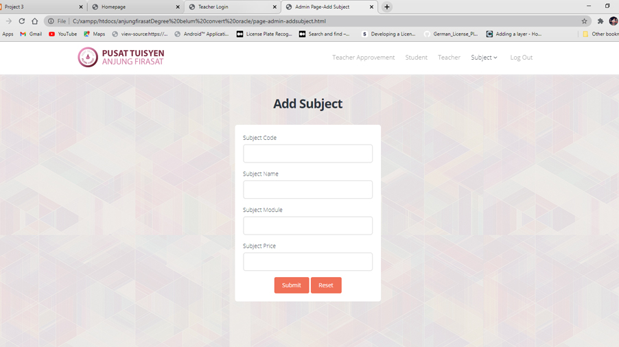
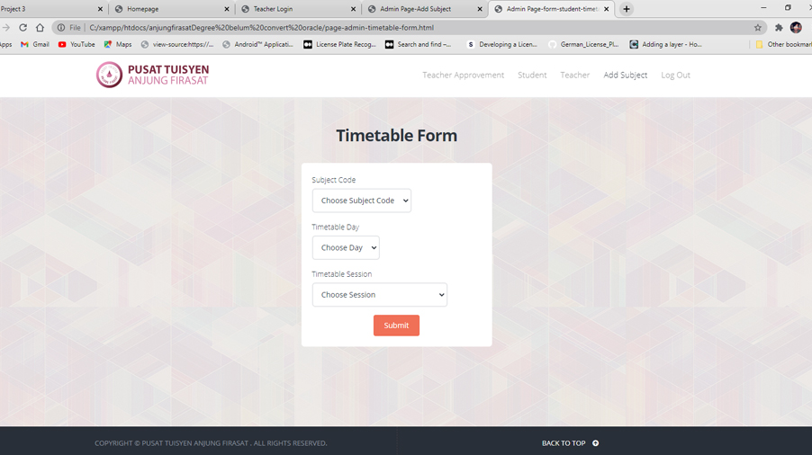
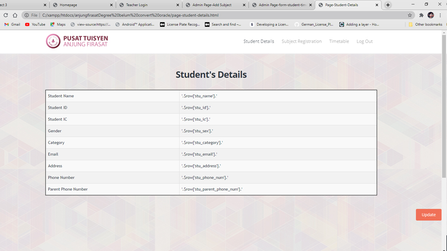

# Tuition-Management-System-using-PHP

#### This is a tuition management system that involved three users which are admin, teacher and student. The system provide a validation system for a teacher who want to join teaching in the tuition center. It provides a timetable function that will managed by admin, who can also add a new subject into the system. PHP and mySQL are used to develop the system.

